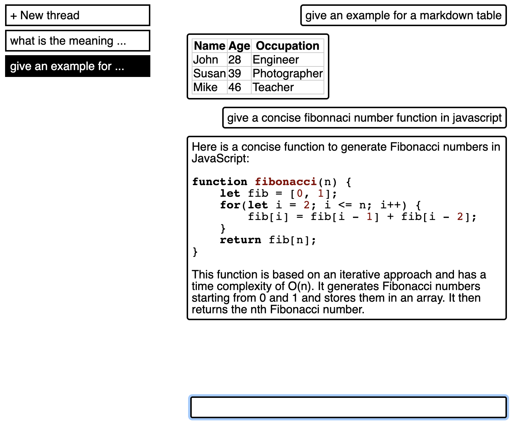

# GPT Lite, An Alternative ChatGPT UI

The GPT4 API is much cheaper than the ChatGPT subscription. This project provides a minimal UI to mimic the basic features of the ChatGPT subscription.

This can save you 240 USD per year, or give you 0.75-2.5 days of additional free time per year.[^1]

- ✅ The core feature is **storing and organizing conversations**, so that results can be retrieved easily, and old conversations can be continued.
- ✅ Live **streaming** of replies is supported.
- ❌ Other features of the ChatGPT subscription, namely **web search and plugins**, are interesting but ultimately rather useless gimmicks, and I do not implement them.
- 🔜 As an additional feature, this UI will allow **editing the system prompt** in a convenient manner, and storing and editing multiple bot personas.

[^1]: Assuming a pay range of 12-40 EUR/h, 8h workdays, 1USD = 1EUR, no taxes on income, and negligible costs for the GPT4 API usage.

## Screenshot

## Usage

1. Create a `.env` file and define your OpenAI API key: `OPENAI_API_KEY=sk-...`
2. `npm install`
3. `npm start`

## Development

Backend and frontend should be run in separate processes, so that both can be hot-reloaded:

- `npm run dev-backend`
- `npm run dev-frontend`

For processing payments with Stripe (optional):

- Using the Stripe dashboard, create a payment link that redirects to the site with `...?top-up=completed`. Store the link in `frontend/static/links.json` in the format `{"paymentLink: "https://buy.stripe.com/..."}`.
- Using the Stripe dashboard, create a webhook for the `checkout.session.completed` event, point it to the site at `.../top-up`. Store the Stripe endpoint secret in `.env`: `STRIPE_ENDPOINT_SECRET=whsec_...`
- Test versions can be created for both of these by activating "Test mode" in the Stripe dashboard.

## License

PolyForm Noncommercial License 1.0.0 (c) David Pomerenke 2023
