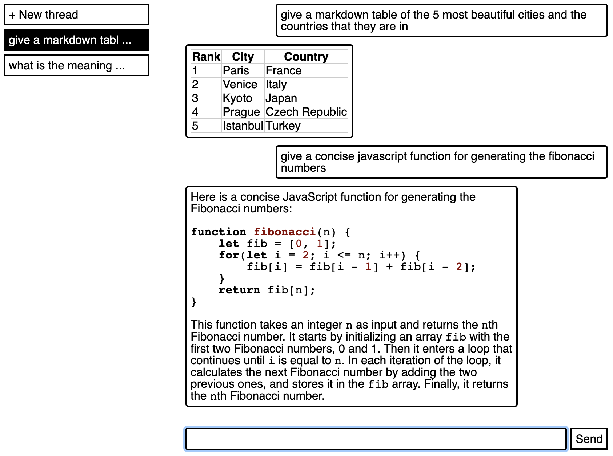

# GPT Lite, An Alternative ChatGPT UI

The GPT4 API is much cheaper than the ChatGPT subscription.[^1] This project provides a minimal UI to mimic the basic features of the ChatGPT subscription.

This can save you 240 USD per year, or give you 0.75-2.5 days of additional free time per year.[^2]

- ✅ The core feature is **storing and organizing conversations**, so that results can be retrieved easily, and old conversations can be continued.
- ✅ Live **streaming** of replies is supported.
- ❌ Other features of the ChatGPT subscription, namely **web search and plugins**, are interesting but ultimately rather useless gimmicks, and I do not implement them.
- 🔜 As an additional feature, this UI will allow **editing the system prompt** in a convenient manner, and storing and editing multiple bot personas.

[^1]: Access to the GPT4 API requires a special application and is not publicly available. This project will therefore be most useful for AI engineeres/researchers/students.

[^2]: Assuming a pay range of 12-40 EUR/h, 8h workdays, 1USD = 1EUR, no taxes on income, and negligible costs for the GPT4 API usage.

## Screenshot

## Usage

1. `npm install`
2. `npm start`

## Development

Backend and frontend should be run in separate processes, so that both can be hot-reloaded:

- `npm run dev-backend`
- `npm run dev-frontend`

## License

PolyForm Noncommercial License 1.0.0 (c) David Pomerenke 2023
